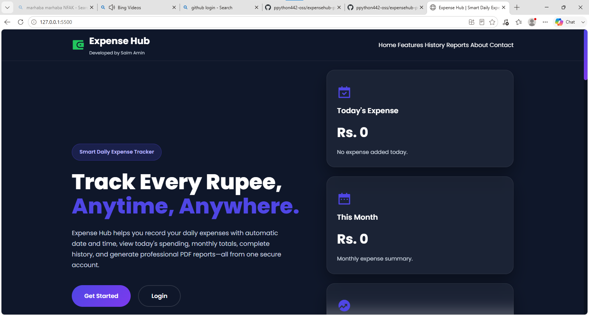
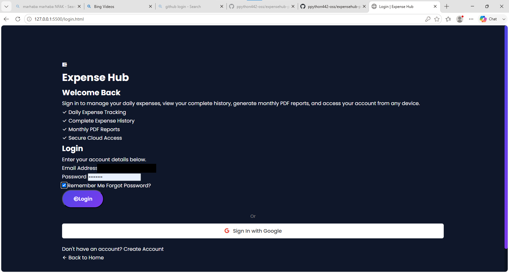
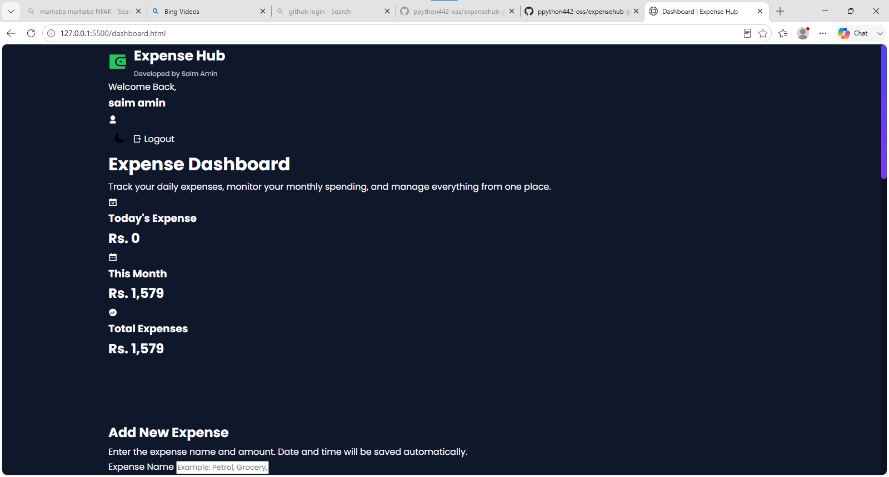
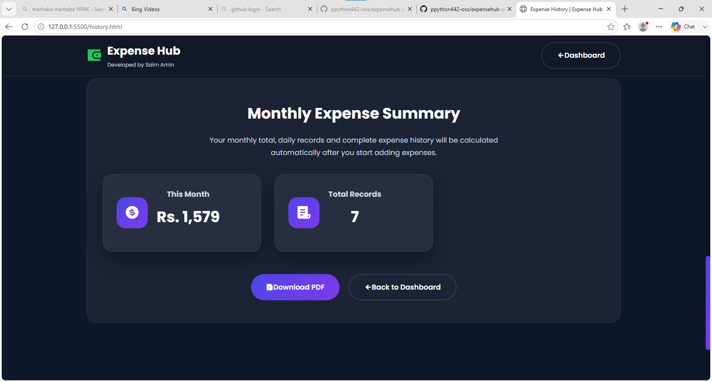
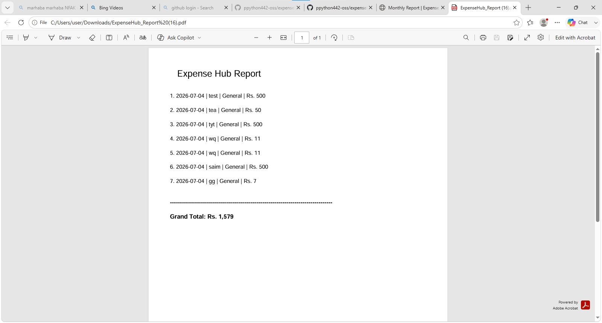

# Expense Hub 💰

A modern expense management web application to track your daily spending, view monthly summaries, and generate PDF reports — all from one secure account.

**🔗 Live demo:** [extensehub.web.app](https://extensehub.web.app/)

---

## Screenshots

### Landing page


### Login


### Dashboard


### Monthly summary & PDF report


### PDF report output


---

## Features

- 🔐 User login & signup with Firebase Authentication
- ➕ Add, view, and track daily expenses
- 📊 Live dashboard — today's expense, monthly expense, total expenses
- 📜 Full expense history
- 📄 One-click PDF report generation (via jsPDF)
- 📱 Responsive design — works on mobile and desktop

## Tech stack

- HTML5, CSS3, JavaScript (ES6)
- Firebase Authentication
- Firebase Realtime Database
- Firebase Hosting
- jsPDF (PDF generation)

## Getting started locally

```bash
git clone https://github.com/ppython442-oss/expensehub-pro.git
cd expensehub-pro
```

Open `index.html` with a local server (e.g. VS Code Live Server extension) — Firebase config is already set up in `firebase.js`.

## Developer

**Saim Amin**

---

© 2026 Expense Hub